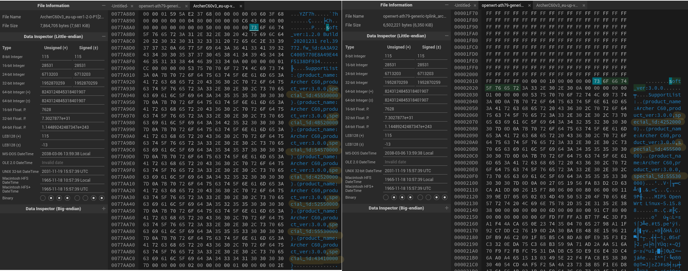

# TP-Link Firmware Checksum Recalculator

## Install Dependicies
```bash
sudo apt install libssl-dev # Install OpenSSL for MD5 calculation
```

## Complie
```bash
make
```

## Usage
```bash
./checksum openwrt-ath79-generic-tplink_archer-c60-v3-squashfs-factory.bin
```
This command will generate a new file called output.bin with recalculated checksum and file size.  
  
---
# Installing OpenWRT on TP-Link Archer C60 v3 (FW Version 1.2.0) with factory WebUI.
Although the [offical Openwrt page of Atcher C60](https://openwrt.org/toh/tp-link/archer_c60_v2) claims that "Latest OEM firmware prevents installation via OEM firmware upgrade paths (tftp and WebUI).", one possible reason that stock WebUI rejects the uploaded OpenWRT firmware is the newer devices' special IDs is not included in the [lateset OpenWRT installation firmware](https://downloads.openwrt.org/releases/22.03.3/targets/ath79/generic/openwrt-22.03.3-ath79-generic-tplink_archer-c60-v3-squashfs-factory.bin).  
  
This problem can be easily solved by replacing the special IDs in the OpenWRT installation firmware and recalculated the checksum using this tool. (Special ID of newer devices can be found in [latest TP-Link Stock FW (V1.2.0)](https://static.tp-link.com/2021/202101/20210118/Archer%20C60(EU)_V3_201231.zip))

By looking for "soft_ver" in the binary with an HEX editor, you can find the latest device special IDs right below.  

(Left: Latest Stock Firmware, Right: OpenWRT Installation Firmware)

This method has been tested on my Archer C60 v3 with the production year of 2022 bought from Taiwan and it works perfectly fine.